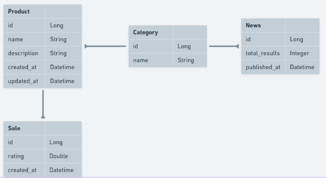

# Hotmart Challenge

## Versão JDK e banco de dados

- Java: 11
- Postgres: latest

## Insomnia
Existe um arquivo json com algumas requisições feitas no Insomnia para testes. Para baixá-lo basta clicar [aqui](files/Insomnia_2020-10-12.json).

## Como rodar o projeto no Linux

### Pré-requisitos

1. Faça um clone do projeto em seu ambiente local:
  ```git clone https://github.com/mfderson/hotmartchallenge.git```
2. Instale o postgres em um container:
   ```docker run --name hotmartchallenge -e POSTGRES_PASSWORD=docker -p 5432:5432 -d postgres```
3. Inicie o container:
   ```docker start hotmartchallenge```
4. Acesse o banco via linha de comando:
   ```docker exec -it hotmartchallenge psql -U postgres```
5. Crie o banco de dados:
   ```create database marketplace;```
6. Verifique se a variável de ambiente JAVA_HOME está na versão do JDK 11:
   ```echo $JAVA_HOME```
7. Se não estiver na versão 11 execute (o path pode variar):
   ```export JAVA_HOME=/usr/lib/jvm/java-11-openjdk-amd64```

### Rodando os testes
1. Entre no diretório do projeto e execute:
   ```mvn test```

### Rodando o projeto
1. Entre no diretório do projeto e execute:
   ```mvn spring-boot:run```
   
## Populando a tabela News
Com o projeto rodando faça a seguinte request:
   ```[GET] localhost:8080/news/populate```

Isso preencherá a tabela News com dados dos últimos 4 dias. Esse atributo está parametrizado no arquivo application.properties:

```marketplace.news-api.number-of-days-to-fill-database=4```

### Regra de negócio para preenchimento inicial
A lista de categorias existente no banco é percorrida. Para cada categoria é feita uma request à api externa com os seguintes parâmetros:

*.path("/everything")*
*.queryParam("q", category)*
*.queryParam("from", dateFrom)*
*.queryParam("to", dateTo)*
*.queryParam("apiKey", apiKey)*

Assim pegamos o atributo totalResults e salvamos o registro na tabela **News** com os dados.

### Regra de negócio para atualização diária
Temos um **cron** cadastrado que executa o código a cada 6hs iniciando à 1h da manhã.

A chamada à api externa é feita passando os seguintes parâmetros:

*.path("/top-headlines")*
*.queryParam("q", category)*
*.queryParam("pageSize", 1)*
*.queryParam("apiKey", apiKey)*

Se a categoria apareceu nas notícias mais relevantes, pegamos o *totalResults* e somamos aos dados na tabela **News**. Claro, se o dado existir para a data corrente, caso contrário é criado um novo.

A notícia pode ter data de publicação que antecede a pesquisa, mas se ela está na lista de *top-headline*, conluímos que ela é relevante na data corrente da pesquisa. Logo somamos aos resultados dessa data e categoria existente no banco.

#### Observações
Escrevendo essa documentação percebi um ato falho. Deveria ter criado uma tabela para salvar apenas as notícias relevantes de acordo com o dia.

Do modo como foi implementado, se a task rodou 1h da manhã e tinham 4 notícias relevantes para categoria X, esse valor é somado. Após isso, quando a task rodar às 7h, se a mesma notícia continuar relevante, é somada novamente ao total na tabela **News**.

Se tivesse criado uma tabela com as notícias relevantes de acordo com a data, era só atualizar esse valor.

## Decisões de implementação

1. Um **produto** pertence a apenas uma **categoria**.
2. Ao cadastrar uma venda, é passado como parâmetro também a avaliação.
3. Os campos comprador e vendedor foram tirados do modelo de negócio.
4. Foi feita uma Basic Authentication apenas com um **usuário/senha (admin/admin)**.

## Banco de dados

Segue esquema do banco de dados:


## Considerações
1. Utilização do flyway para migração dos dados.
   1. Porém adicionei scripts para salvar dados de teste e isso não é uma boa prática. O ideal seria criamos um banco de testes para salvar esses dados.
2. A ordenação dos productos ficou hardcode. Não encontrei uma forma de passar um parâmetro *sort* no *pageable* dado que utilizei interface-based projections.
3. Foi feita a documentação da api somente para o crud de produtos. Para acessá-la basta rodar o projeto e acessar o link <localhost:8080/swagger-ui.html>
